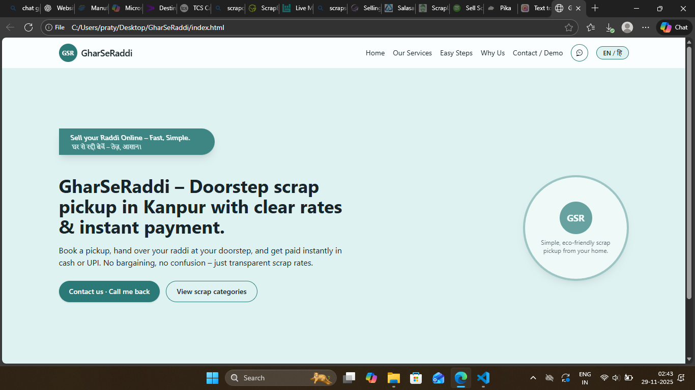
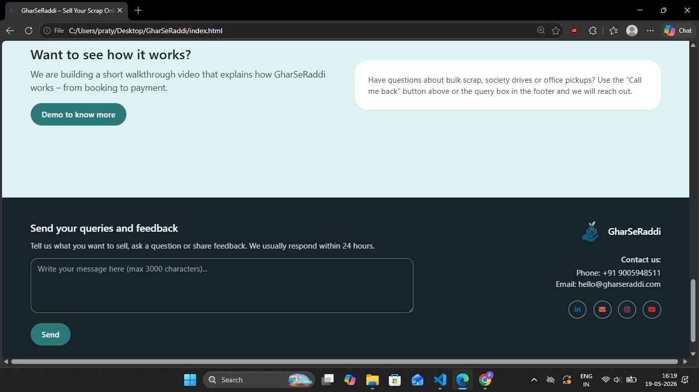

# GharSeRaddi

GharSeRaddi is a smart doorstep scrap collection platform designed to make selling household waste simple, transparent, and convenient.

## Features
- Doorstep scrap pickup
- Transparent scrap pricing
- Multiple categories (Paper, Plastic, E-waste)
- Responsive UI design
- Language toggle (English / Hindi)
- Search and filter functionality
- Contact and pickup request form

## Tech Stack
- HTML
- Tailwind CSS
- JavaScript
- Formspree

## Project Goal
To provide a simple and eco-friendly solution for managing and recycling household scrap efficiently.

## Future Improvements
- User authentication
- Pickup scheduling system
- Admin dashboard
- Real-time tracking
- AI-based waste classification

## Screenshots

<p align="center">
  
  
  
</p>


## Run Locally

```bash
git clone https://github.com/pratyaksha-projects/GharSeRaddi.git
cd GharSeRaddi
open index.html
```

## Author
Pratyaksha Saini
